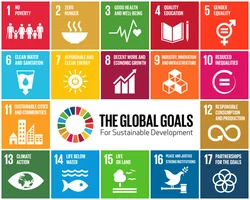

# UNITED NATIONS ACCESS TO BASIC SERVICES DATASET FOR YEARS 2015-2020

## 🔍PROJECT OBJECTIVE:

- This project aims to influence strategic decision making of allocations of the United Nations resources towards countries that are MOST in need of them.
- Insights from this project strive to reduce the amount of wastage of resources - financial losses, experienced due to lack of proper data analysis of historical information, hence inefficient resource and data management.

## 📑DATA

This Dataset contains informations about the following Economic Metrics for countries:

1. Percentage Access to Drinking water services
2. Percentage Access to Sanitation services
3. GDP of a Particular country at particular Time period
4. Population in a particular Country

## 🚩QUESTIONS FROM THE UNITED NATIONS 
The Following Data Analysis seeks to answer these core UN Questions:

- What is the minimum and maximum access to drinking water services in each African Country?
- What is the average access to sanitation services in Sub_Saharan Africa?
- Which countries require MOST assistance from the UN due to low access to the Basic services?
- Does Political Instability affect Percentage Access to Water services?
- Regional Economic Communities in West Africa
- Evaluating GDP per capita and Income Group of each country based on the Poverty Line Index in 2020

## 🛠METHODOLOGY:
- I leverage SQL Queries including *Window functions* and *CTEs* to extract relevant answers to the above questions, offering strategic insights on the nature of Water levels and Sanitation levels of countries in question. 
